# 📦 Sanchara – Courier Management System (Full Stack Project) 🚚

A complete **CourierEase Online Delivery Platform**, built with a **React-based frontend** and a **.NET Core + SQL Server backend**. This system allows users to book courier shipments, track delivery status, and contact support. Admins and agents can manage users, shipments, and overall operations.

---

## 🧩 Tech Stack Overview

| Layer         | Technology                         |
|---------------|------------------------------------|
| Frontend      | React, React Router, Axios         |
| Backend       | ASP.NET Core Web API, C#, EF Core  |
| Database      | SQL Server                         |
| Security      | JWT Authentication                 |
| Build Tools   | npm (frontend), .NET CLI (backend) |

---

## 🔐 Key Features

### ✅ Authentication
- User **signup** and **login**
- JWT-based security and role-based access (Customer, Admin, Agent)
- Protected routes and headers

### 🚚 Shipment Management
- Users can book courier deliveries
- View and track shipment status
- Admins and agents manage all shipments

### 🧑 Admin Panel
- Admins can manage users and assign couriers
- Agents can update delivery statuses

### 📋 Contact & Feedback
- Public contact and feedback forms for queries

---

## 🗂️ Project Structure

### 🔧 Backend (`/Backend/CourierEase_Backend`)
```
├── CourierEase.API/
│   ├── Controllers/
│   ├── Models/
│   ├── DTOs/
│   ├── Services/
│   ├── Interfaces/
│   ├── Data/
│   ├── Middleware/
│   ├── appsettings.json
│   └── Program.cs / Startup.cs
├── CourierEase.sln
```

### 🎨 Frontend (`/Frontend`)
```
/src
├── components/
│   ├── About.jsx
│   ├── ContactUs.jsx
│   ├── Feedback.jsx
│   ├── Home.jsx
│   ├── Admin/
│   │   ├── AdminDashboard.jsx
│   │   ├── OrdersList.jsx
│   │   └── UsersList.jsx
│   ├── Auth/
│   │   ├── Login.jsx
│   │   └── Signup.jsx
│   ├── Layout/
│   │   ├── Footer.jsx
│   │   └── Navbar.jsx
│   └── User/
│       └── UserDashboard.jsx
├── pages/
│   └── AddOrder.jsx
├── services/
│   └── api.js
├── App.jsx
├── main.jsx
├── index.css
└── App.css
```

---

## 🔗 Routing (Frontend)

| Path              | Component          | Access         |
|-------------------|--------------------|----------------|
| `/`               | Home               | Public         |
| `/about`          | About              | Public         |
| `/contact`        | ContactUs          | Public         |
| `/feedback`       | Feedback           | Public         |
| `/login`          | Login              | Public         |
| `/signup`         | Signup             | Public         |
| `/user/dashboard` | UserDashboard      | Authenticated  |
| `/admin`          | AdminDashboard     | Admin Only     |
| `/admin/orders`   | OrdersList         | Admin Only     |
| `/admin/users`    | UsersList          | Admin Only     |
| `/add-order`      | AddOrder           | Authenticated  |

---

## 🔐 Backend Authentication

- Endpoints:
  - `POST /api/auth/register`
  - `POST /api/auth/login`
- Use the JWT token from response in all protected requests:

```
Authorization: Bearer <your_token>
```

---

## 📘 API Endpoints (Backend)

### 🔑 Auth
| Method | Endpoint            | Description              |
|--------|---------------------|--------------------------|
| POST   | `/api/auth/register`| Register user            |
| POST   | `/api/auth/login`   | Login with credentials   |

### 👤 Users
| Method | Endpoint               | Description               |
|--------|------------------------|---------------------------|
| GET    | `/api/user/shipments`  | List user shipments       |
| POST   | `/api/user/shipments`  | Book a new shipment       |

### 🚚 Couriers
| Method | Endpoint                | Description               |
|--------|-------------------------|---------------------------|
| GET    | `/api/admin/shipments`  | View all shipment records |
| PUT    | `/api/agent/update`     | Update delivery status    |

### 🧑 Admin
| Method | Endpoint                | Description               |
|--------|-------------------------|---------------------------|
| GET    | `/api/admin/users`      | Manage platform users     |
| POST   | `/api/admin/couriers`   | Add courier personnel     |

---

## 🧾 Database Schema

### `Users`
| Column     | Type     |
|------------|----------|
| Id         | int      |
| Name       | string   |
| Email      | string   |
| Password   | string   |
| Role       | string   |

### `Shipments`
| Column       | Type       |
|--------------|------------|
| Id           | int        |
| SenderId     | int (FK)   |
| ReceiverName | string     |
| Address      | string     |
| Status       | string     |
| CourierId    | int (FK)   |

---

## ⚙️ Setup Instructions

### Backend

1. Update your DB config in `appsettings.json`:

```json
{
  "ConnectionStrings": {
    "DefaultConnection": "Server=localhost;Database=CourierEaseDB;Trusted_Connection=True;"
  },
  "Jwt": {
    "Key": "your_jwt_secret_key",
    "Issuer": "CourierEaseAPI",
    "Audience": "CourierEaseClient",
    "DurationInMinutes": 60
  }
}
```

2. Run the backend:

```bash
dotnet restore
dotnet ef database update
dotnet run --project CourierEase.API
```


---

### Frontend

1. Install dependencies:

```bash
npm install
```

2. Run development server:

```bash
npm run dev
```


---

## 📸 Preview

Here’s how the page looks:

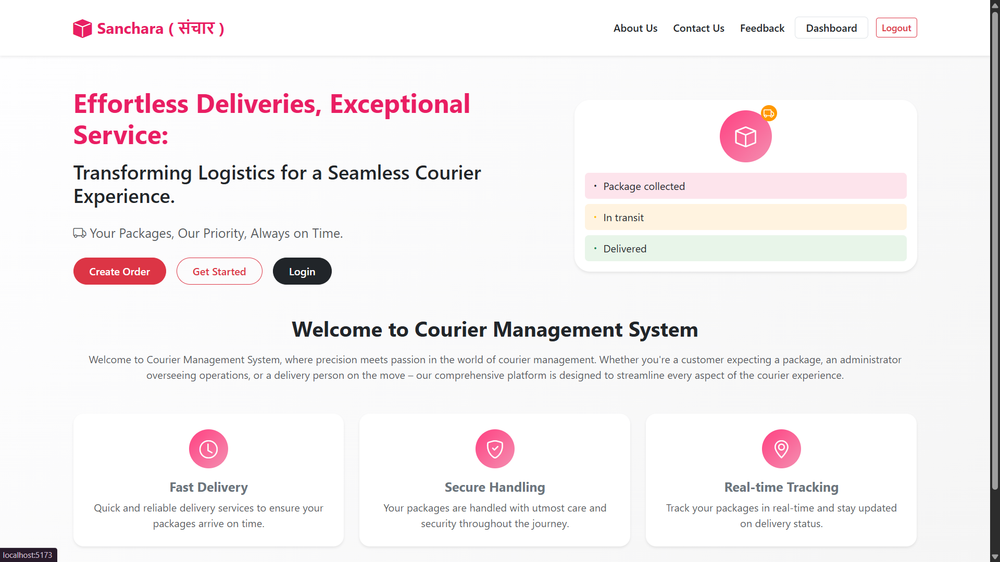
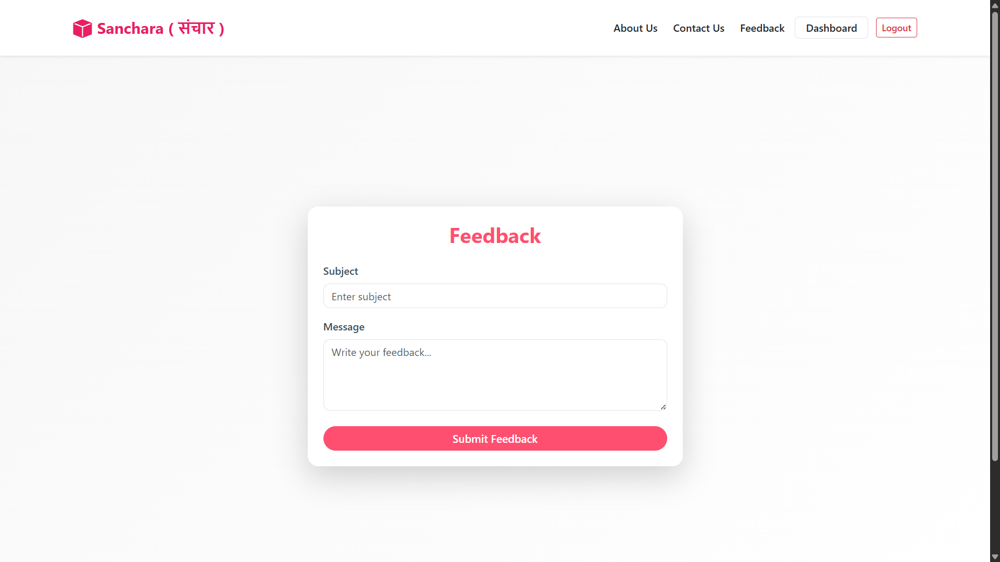 
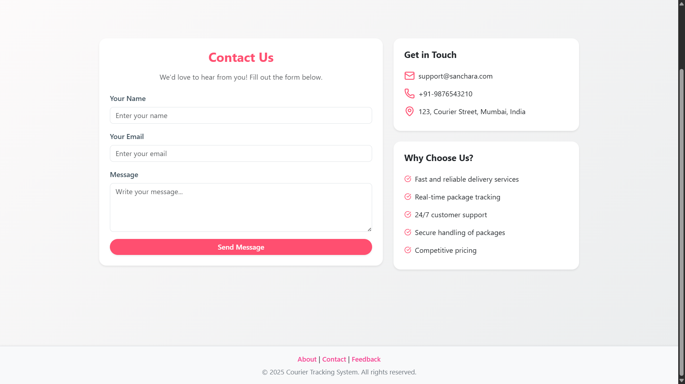 
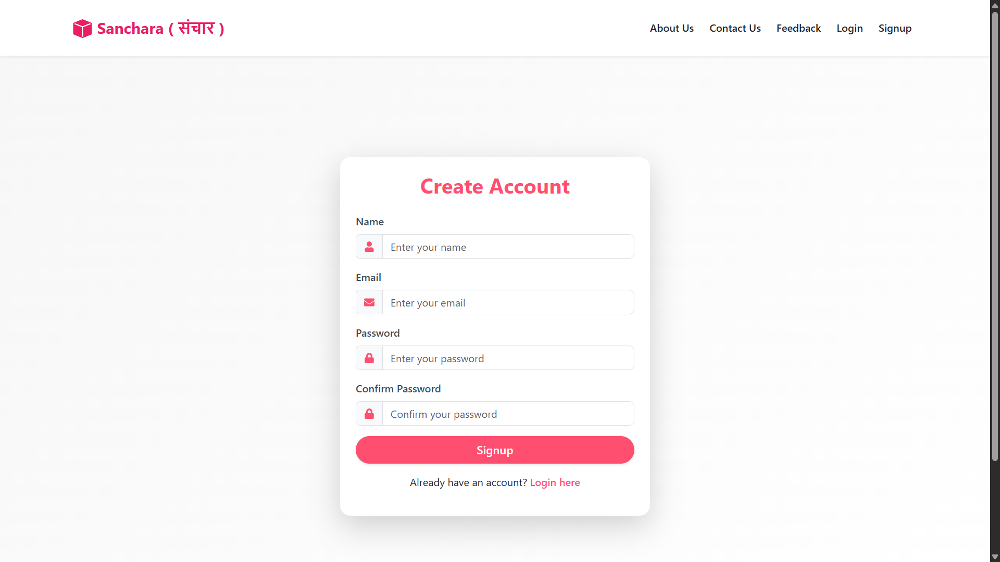 
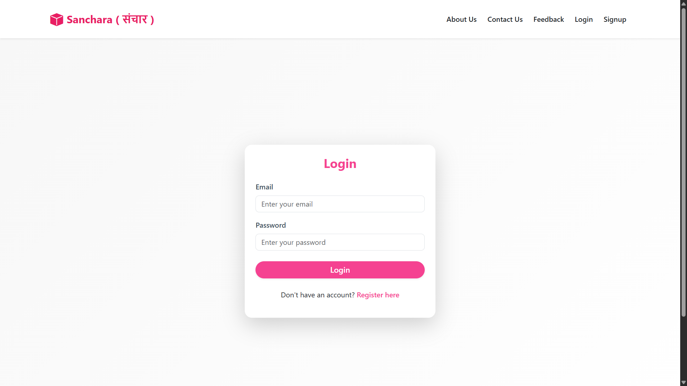 
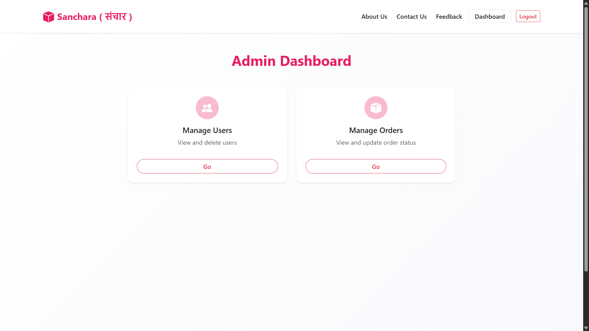 
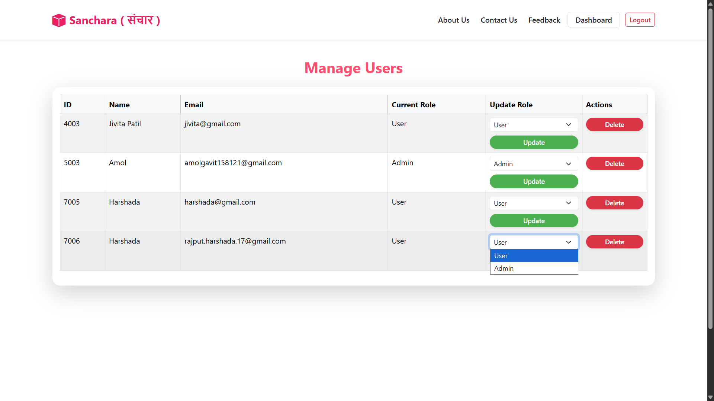
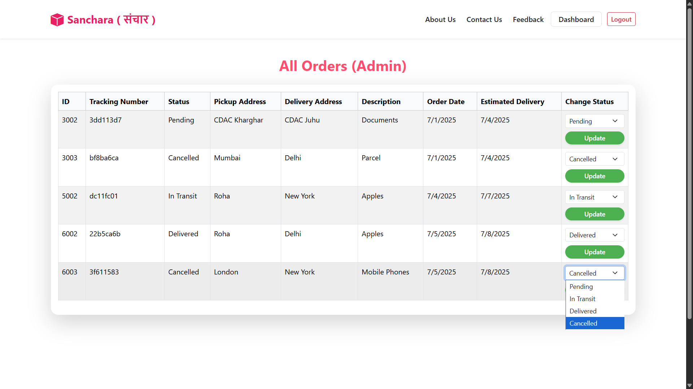
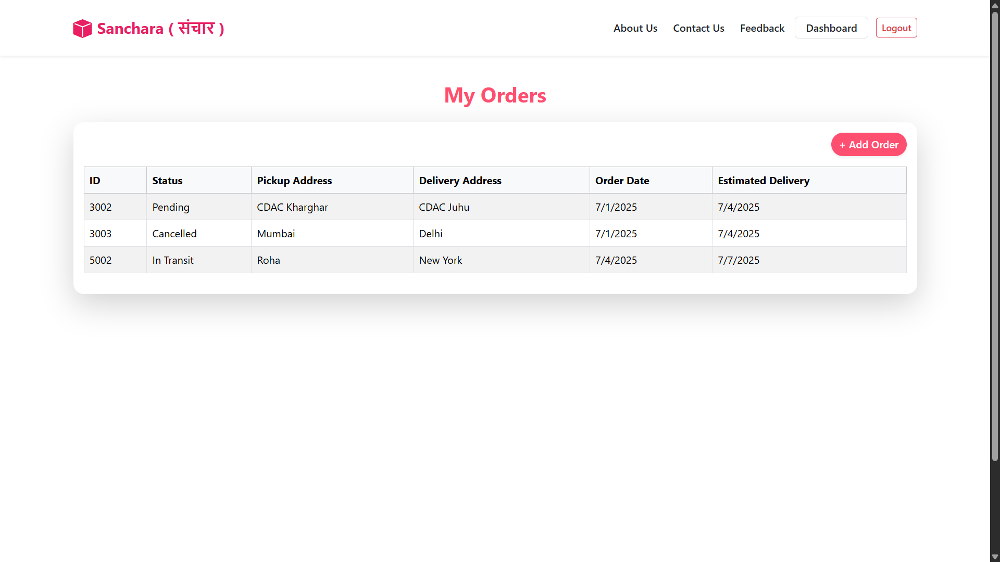
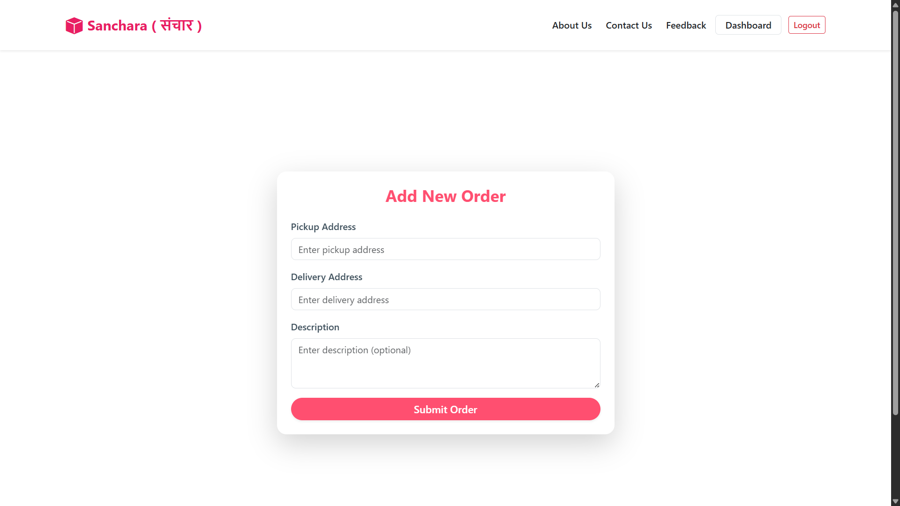
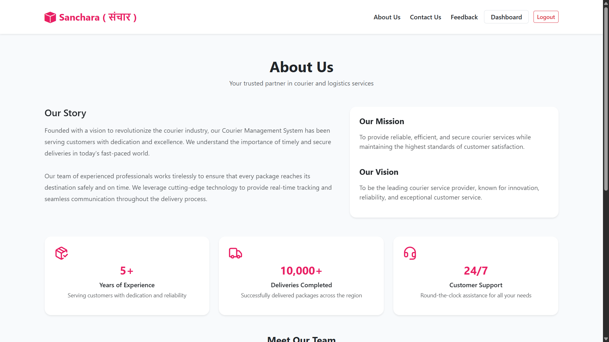


---