# 🚗 Car Service Booking Platform – Full Stack Project

A complete **CarServiceHub Online Service Portal**, consisting of a **React-based frontend** and a **Spring Boot + MySQL backend**. This platform allows users to book car service appointments, browse workshops, and give feedback, while admins can manage workshops and view all service requests.

---

## 🧩 Tech Stack Overview

| Layer         | Technology                    |
|---------------|-------------------------------|
| Frontend      | React, Bootstrap, Axios       |
| Backend       | Spring Boot, Java 21, MySQL   |
| Database      | MySql                         |
| Security      | JWT Authentication            |
| Build Tools   | npm (frontend), Maven (backend)|

---

## 🔐 Key Features

### ✅ Authentication
- User **signup** and **login**
- JWT token-based security and role-based access
- Frontend route protection

### 🛠️ Workshop Management
- View workshops (public)
- Admins can add, edit, delete workshops

### 📅 Service Requests
- Book service appointments with time slots
- Track requests (user & admin views)
- Admins can see requests across all users and workshops

### 📋 Feedback & Contact
- Public feedback form
- Contact page for support

---

## 🗂️ Project Structure

### 📦 Backend (`/Backend/Car_Service_Platform`)
```
├── src/
│   ├── main/
│   │   ├── java/com/carservice/
│   │   │   ├── controller/
│   │   │   ├── dao/
│   │   │   ├── dto/
│   │   │   ├── entity/
│   │   │   ├── security/
│   │   │   └── service/
│   │   └── resources/
│   │       └── application.properties
├── pom.xml
```

### 🎨 Frontend (`/Frontend`)
```
/src
├── assets/images/
├── components/
│   ├── Navbar.jsx
│   ├── Footer.jsx
│   └── ProtectedRoute.jsx
├── pages/
│   ├── Home.jsx
│   ├── About.jsx
│   ├── ContactUs.jsx
│   ├── Feedback.jsx
│   ├── Services.jsx
│   ├── AdminDashboard.jsx
│   ├── Login.jsx
│   └── Signup.jsx
├── App.jsx
├── main.jsx
└── index.css
```

---

## 🔗 Routing (Frontend)

| Path             | Component         | Access         |
|------------------|-------------------|----------------|
| `/`              | Home              | Public         |
| `/about`         | About             | Public         |
| `/contact`       | ContactUs         | Public         |
| `/feedback`      | Feedback          | Public         |
| `/login`         | Login             | Public         |
| `/signup`        | Signup            | Public         |
| `/services`      | Services          | Authenticated  |
| `/admin`         | AdminDashboard    | Admin Only     |

---

## 🔐 Backend Authentication

- Endpoints:
  - `POST /auth/signup`
  - `POST /auth/login`
- Response includes a JWT token:
  ```
  Authorization: Bearer <your_token>
  ```
- Token is used for all protected routes.

---

## 📘 API Endpoints (Backend)

### 🔑 Auth
| Method | Endpoint       | Description           |
|--------|----------------|-----------------------|
| POST   | `/auth/signup` | Register a new user   |
| POST   | `/auth/login`  | Login and get JWT     |

### 👥 Users
| Method | Endpoint                | Description                    |
|--------|--------------------------|--------------------------------|
| GET    | `/user/service-requests`| View own requests              |
| POST   | `/user/service-requests`| Create service request         |

### 🛠️ Admin Workshops
| Method | Endpoint              | Description                   |
|--------|------------------------|-------------------------------|
| GET    | `/api/workshops`       | View all (public)             |
| POST   | `/admin/workshops`     | Add workshop (admin only)     |
| PUT    | `/admin/workshops/{id}`| Edit workshop                 |
| DELETE | `/admin/workshops/{id}`| Delete workshop               |

### 📋 Admin Requests
| Method | Endpoint                 | Description                   |
|--------|--------------------------|-------------------------------|
| GET    | `/admin/service-requests`| Admin view of all requests    |

---

## 🧾 Database Schema

### `user`
| Column     | Type           |
|------------|----------------|
| id         | BIGINT         |
| first_name | VARCHAR(255)   |
| last_name  | VARCHAR(255)   |
| email      | VARCHAR(255)   |
| password   | VARCHAR(255)   |
| role       | ENUM           |

### `workshop`
| Column         | Type         |
|----------------|--------------|
| id             | BIGINT       |
| name           | VARCHAR(255) |
| address        | VARCHAR(255) |
| contact_number | VARCHAR(255) |

### `service_request`
| Column           | Type           |
|------------------|----------------|
| id               | BIGINT         |
| car_model        | VARCHAR(255)   |
| customer_name    | VARCHAR(255)   |
| issue_description| TEXT           |
| appointment_date | DATETIME       |
| user_id          | BIGINT (FK)    |
| workshop_id      | BIGINT (FK)    |

---

## ⚙️ Setup Instructions

### 🛠️ Backend Setup

1. Update `application.properties`:

```properties
spring.datasource.url=jdbc:mysql://localhost:3306/car_service_db
spring.datasource.username=root
spring.datasource.password=your_password
jwt.secret=your_secret_key
```

2. Build and run:

```bash
mvn clean install
mvn spring-boot:run
```

Server: `http://localhost:8080`

---

### 🖥️ Frontend Setup

1. Install dependencies:

```bash
npm install
```

2. Start development server:

```bash
npm run dev
```

App runs at: `http://localhost:5173`

> Ensure the backend is running at `http://localhost:8080`

---

## 📸 Preview

Here’s how the page looks:

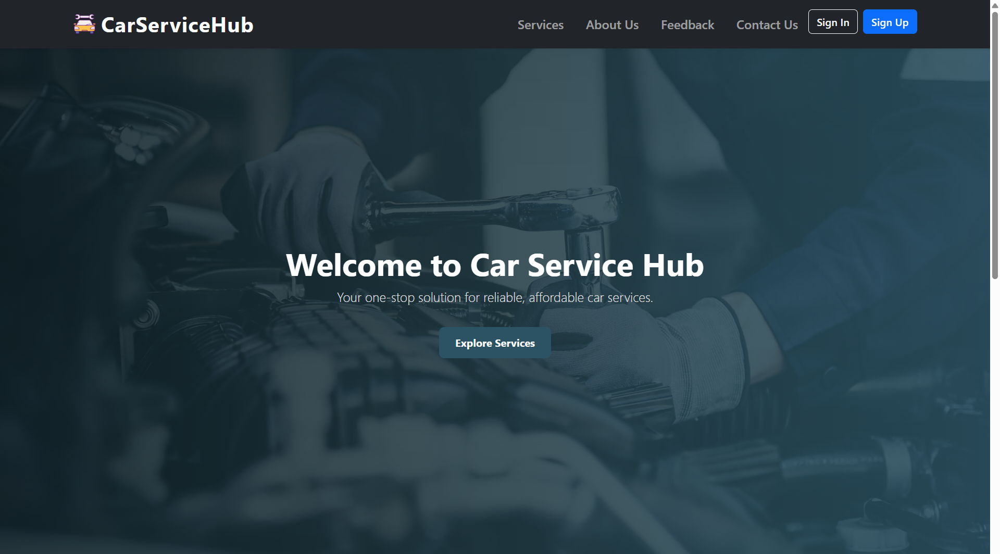 
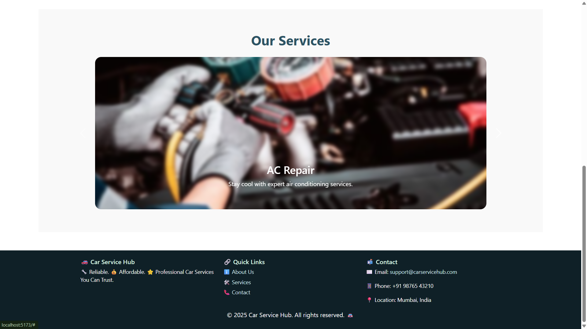 
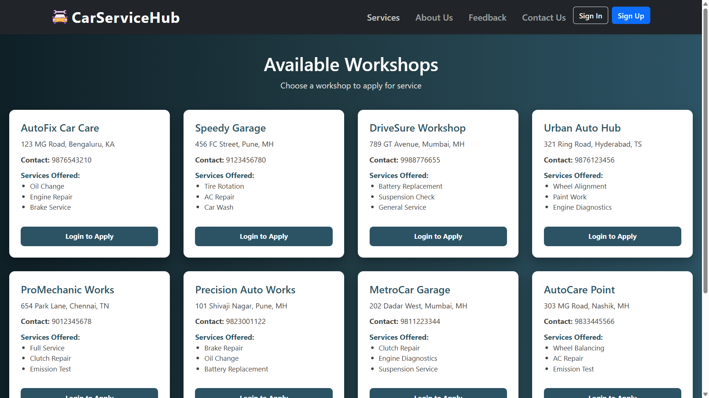 
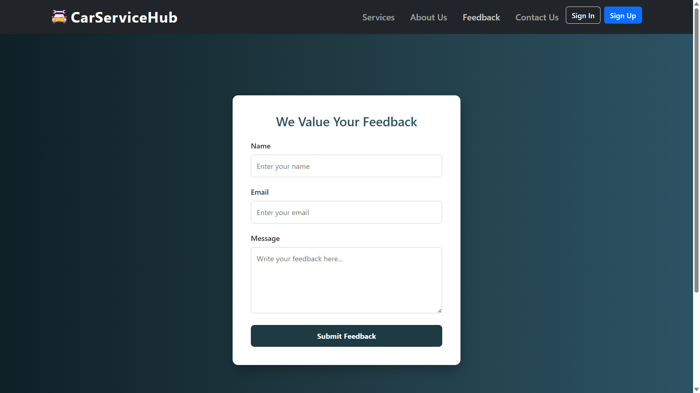 
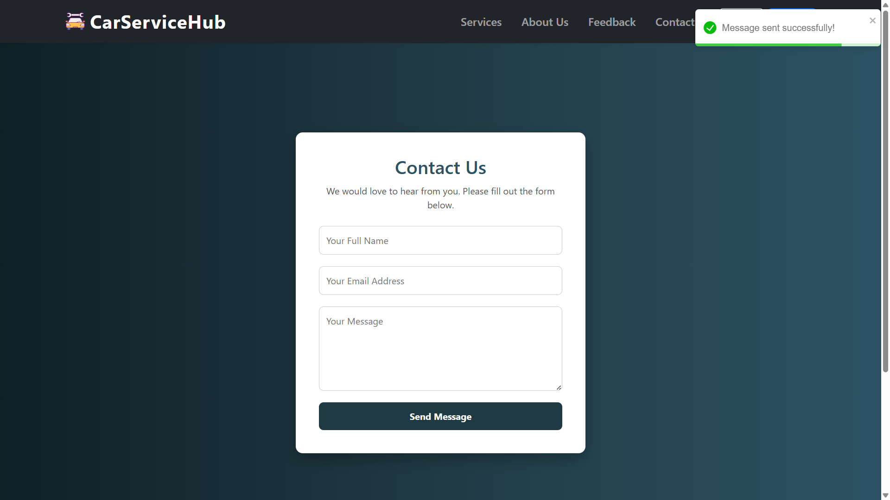 
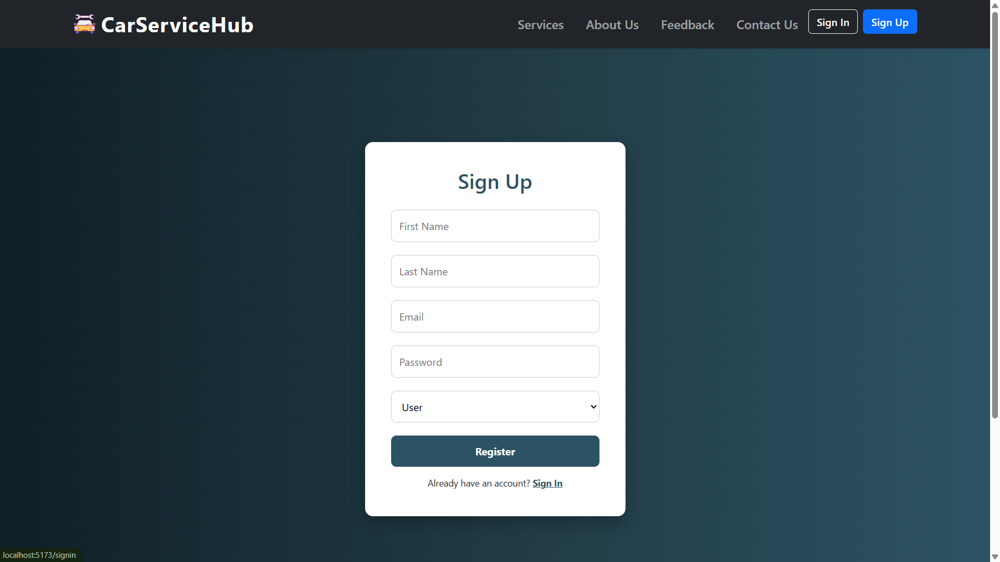 
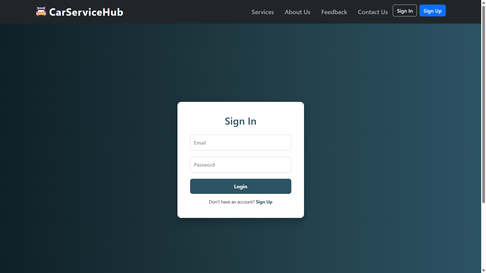 
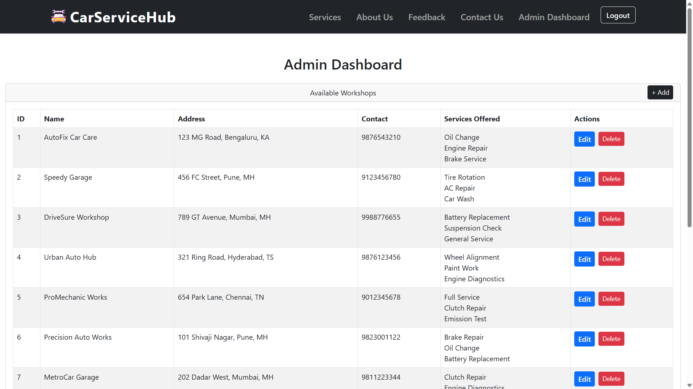 
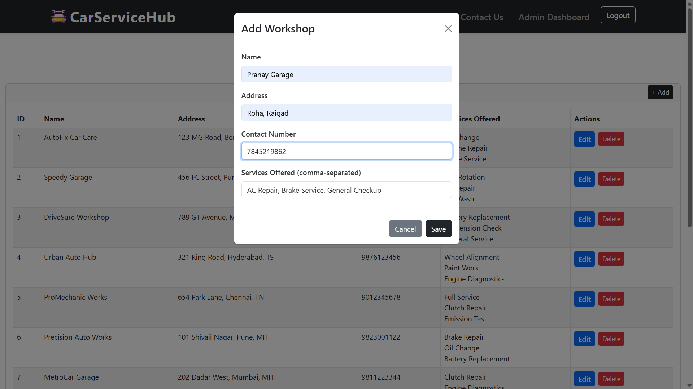 
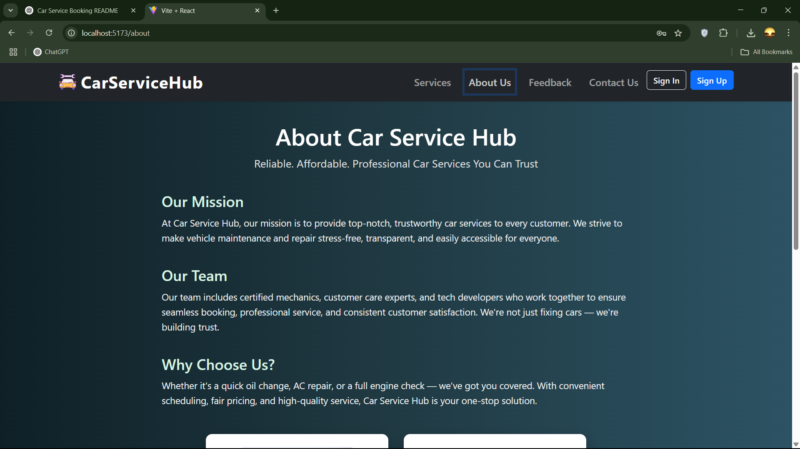
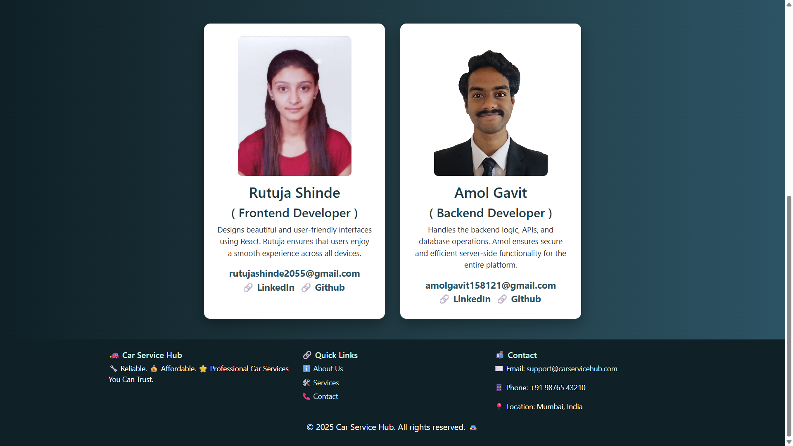

---