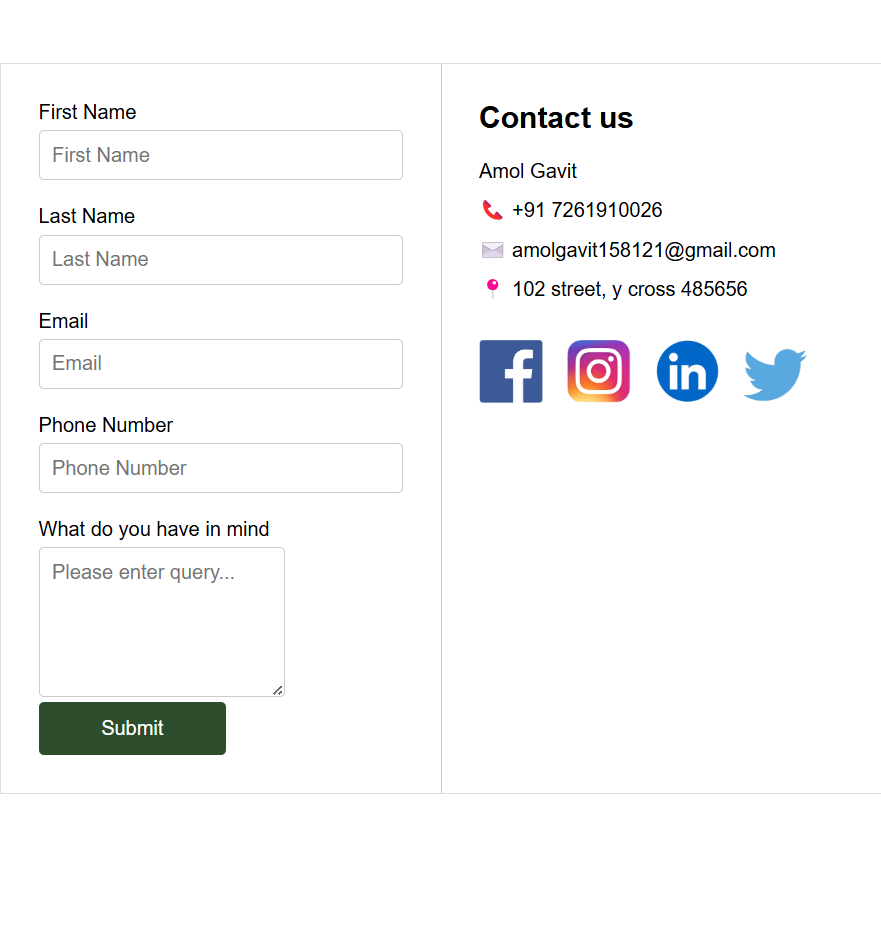

# :books: Contact Page :ledger:
## This project is a simple and clean **Contact Us** page designed using **HTML5** and **CSS3**.

### It features a responsive form layout for users to submit their contact details and queries, along with contact information and social media links.


## ✨ Features

- Responsive two-column layout
- Contact form with fields:
  - First Name
  - Last Name
  - Email
  - Phone Number
  - Query/Message
- Styled submit button with hover effects
- Company contact information section
- Social media icons for Facebook, Instagram, LinkedIn, and Twitter
- Neat and clean design


## 📁 Project Structure

```
/Assets
  /Images
    FaceBook.png
    Instagram.png
    LinkedIn.png
    Twitter.png
Contact_page.html
Contact_page.css
```


## Technologies and Tools Used

[](https://skillicons.dev) 


## 📸 Preview

Here’s how the page looks:

 
