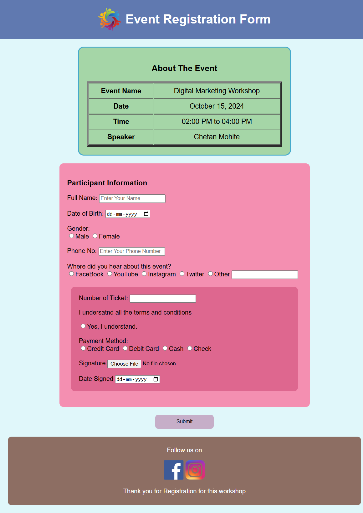

# 🎉 Event Registration Form
## This project is a **Digital Marketing Workshop Registration Form** created using HTML and CSS. It provides a simple and styled user interface for participants to register for an upcoming event.

## ✨ Features

- Responsive two-column layout
- Contact form with fields:
  - First Name
  - Last Name
  - Email
  - Phone Number
  - Query/Message
- Styled submit button with hover effects
- Company contact information section
- Social media icons for Facebook, Instagram, LinkedIn, and Twitter
- Neat and clean design

## 📂 Project Structure

- `Registration_Form.html`  
  Contains the HTML structure and form inputs.

- `file.css`  
  External CSS file for styling and layout.

- `Assets/Images/`  
  Folder containing images used in the project (e.g., logo, social media icons).

---

## Technologies and Tools Used

 

## 📸 Preview

Here’s how the page looks:

 

