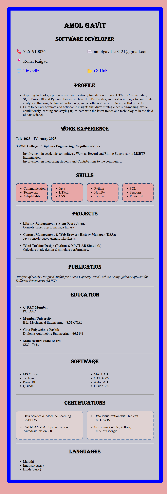

# 📄 Resume Project - HTML & CSS

## This project is a **responsive and styled resume webpage**, designed using **pure HTML5** and **CSS3**.  
### It demonstrates a clean layout, organized sections, custom typography, and a colorful professional design.


---

## 📂 Project Structure

```
Resume.html
Resume.png (Preview Image)
```

- `Resume.html`: Main HTML file containing all content and internal styling.
- `Resume.png`: Screenshot preview of the resume webpage.

---


## 🎨 HTML Structure Overview

The main structure follows a simple yet semantic hierarchy:

- `<div class="heading1">`  
  Main container for all content (centered with padding and border).

Inside it:

- `<h1>` and `<h2>` tags  
  Used for the name, title, and section headings.

- `<div class="contact">`  
  A flex container for displaying contact information in two columns.

- `<ul>` and `<li>` lists  
  Used extensively for listing:
  - Profile highlights
  - Work experiences
  - Skills
  - Projects
  - Education
  - Software knowledge
  - Certifications
  - Languages

- `<div class="skills">`, `<div class="education">`, `<div class="software">`, `<div class="certs">`  
  Each section is wrapped in a flexbox layout for neat, responsive design.

- `<a>` tags  
  For external links to LinkedIn and GitHub profiles (opening in a new tab).

---

## 🎨 CSS Design Overview

- **Font Styles**:
  - Default: `'Times New Roman'`
  - Heading: `'Algerian'` (for h1 and h2 to create a bold, vintage look)

- **Layout**:
  - Centralized content with `max-width` and `margin: auto`
  - Consistent padding and spacing using `padding`, `gap`, and `flex-wrap`

- **Flexbox**:
  - Used for organizing contact details, skills, education, software, and certifications into multi-column layouts.

- **Color Scheme**:
  - **Background**: Light pinkish (`#e8a7a7`)
  - **Container**: Light gray (`rgb(198, 198, 209)`)
  - **Borders**: Solid blue borders around the main resume block
  - **Skill Boxes and Certificates**: Dashed borders with thematic colors

- **Borders & Radius**:
  - The main container and individual skill/certification boxes have **rounded corners** using `border-radius: 15px`.
  - Skill sections and certifications also feature **dashed borders** for stylistic separation.

- **Responsive Behavior**:
  - The `flex-wrap: wrap` property ensures that sections adjust across smaller screens without breaking layout.

---


## Technologies and Tools Used

[](https://skillicons.dev) 


## 📸 Preview

Here’s how the page looks:

 


## 📈 Future Enhancements

- Add **responsive media queries** for even better mobile optimization.
- Split CSS into a **separate external stylesheet**.
- Add **downloadable PDF generation** functionality using JavaScript libraries.
- Deploy on **GitHub Pages** for live web hosting.

---


