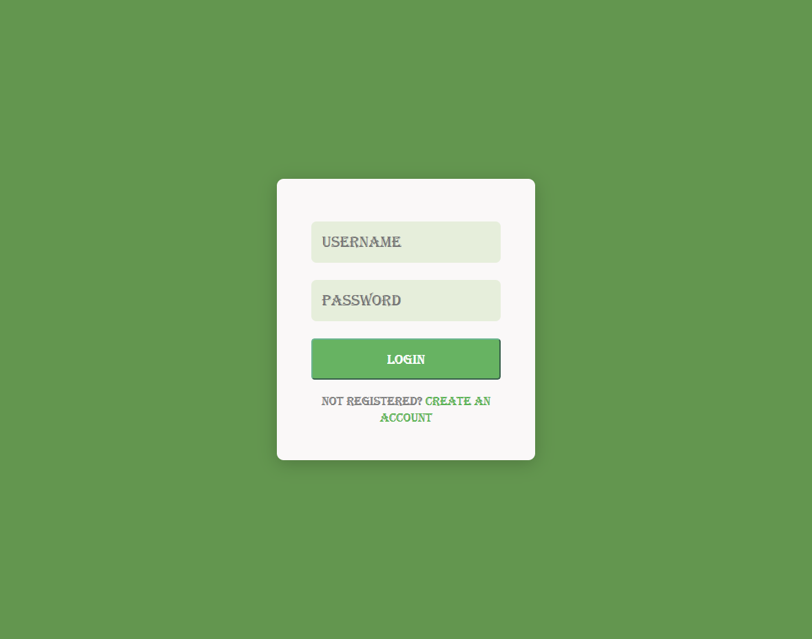

# 🌿 Simple Login Page

## This project is a **simple and elegant login page** designed using **HTML** and **CSS**. It features a clean green-themed interface, perfect for beginner projects, small applications, or templates for larger projects.


---

## 📄 About the Project

- **Login Box** centered both vertically and horizontally.
- **Input Fields** for username and password.
- **Login Button** with hover effects.
- **Registration Link** for users who are not registered.
- **Responsive Design** for different screen sizes.
- **Clean and Minimalistic UI** with a soft green color palette.

---

## 🚀 Project Structure

```
/project-folder
│
├── Sign_In.html    # Main HTML file containing the form structure
├── Sign_In.css     # Styling file for design and responsiveness
├── Sign_In.png     # Screenshot of the login page
└── README.md       # Project description and usage guide
```

## 📚 Files Description

| File           | Description                                              |
|----------------|-----------------------------------------------------------|
| `Sign_In.html` | Contains the structure of the login form.                 |
| `Sign_In.css`  | Contains the styling for the login form and layout.        |
| `Sign_In.png`  | Preview image showcasing the final look of the login form. |

---


## Technologies and Tools Used

[](https://skillicons.dev) 


## 📸 Preview

Here’s how the page looks:

 


## 🔥 Future Improvements

- Add backend functionality for login authentication.
- Create a registration page linked to the "Create an account" link.
- Improve responsiveness for mobile devices.
- Add error messages for incorrect login attempts.

---


