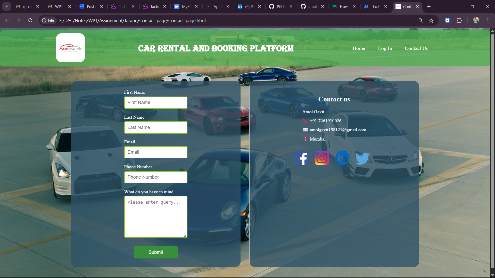

# Contact Page

This is a simple and visually appealing **Contact Us** page for a Car Rental and Booking Platform, designed using **HTML** and **CSS**. The page includes a contact form, contact information, and social media links, all presented on a clean, car-themed background.


## 🌟 Features

- Responsive contact form with fields for name, email, phone number, and message
- Contact details section with location and social media icons
- Styled navigation bar with internal links (Home, Log In, Contact Us)
- Custom background with overlaid containers
- Hover effects on navigation and social links


## 📁 Project Structure

```
├── Contact_page.html       # Main HTML file
├── Contact_page.css        # CSS styling file
├── Contact_Page.png        # Screenshot of the Contact Page
└── Assets/
    └── Images/             # Contains logo and social media icons (not provided in this repo)
```


## Technologies and Tools Used

[](https://skillicons.dev) 


## 📸 Preview

Here’s how the page looks:
 


