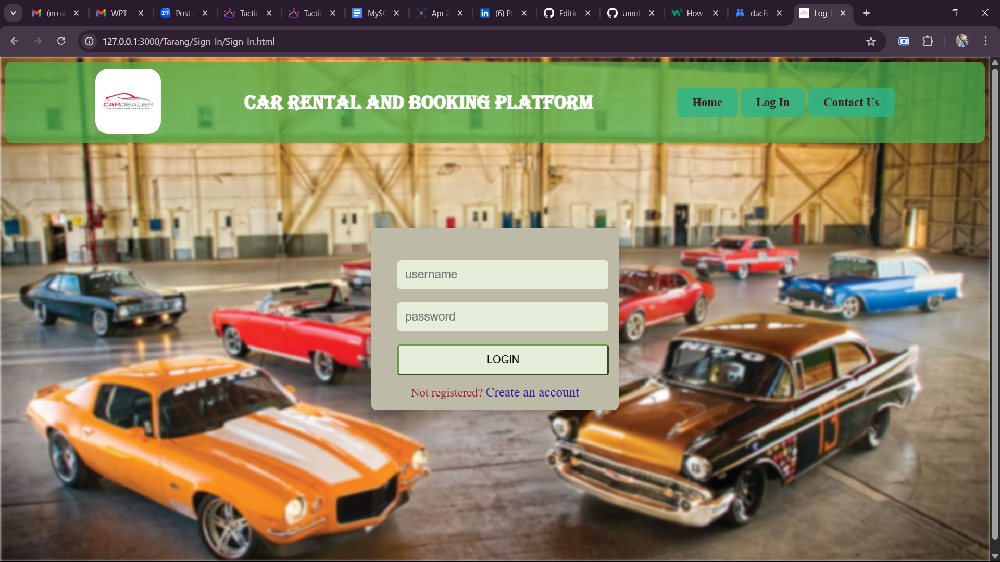
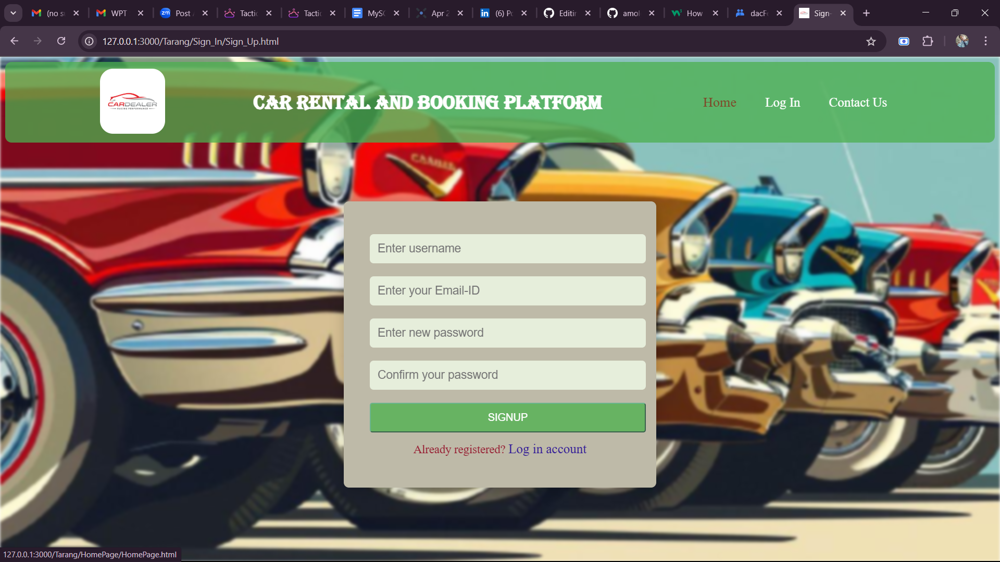

# Sign-In & Sign-Up – Authentication Pages

This project provides responsive and visually appealing **Sign In** and **Sign Up** pages for a car rental and booking platform. The UI is styled with pure CSS and designed for basic frontend authentication workflows.

---

## 📁 Project Structure

```
/
├── Sign_In.html         # Login page
├── Sign_Up.html         # Registration page
├── Sign_In.css          # CSS for login page
├── Sign_Up.css          # CSS for registration page
└── Assets/
    └── Images/
        ├── logo.jpg
        ├── backgroundin.jpg
        └── backgroundup.jpg
```

---

## 🌐 Pages Overview

### 🔐 Sign In (`Sign_In.html`)
- Features:
  - Username and password input
  - Responsive layout with background blur
  - Navigation bar with links
  - Styled hover effects
- Linked CSS: `Sign_In.css`
- Background image: `backgroundin.jpg`

### 📝 Sign Up (`Sign_Up.html`)
- Features:
  - Username, Email, Password, Confirm Password fields
  - Visual consistency with the Sign In page
  - Navigation and hover interactivity
- Linked CSS: `Sign_Up.css`
- Background image: `backgroundup.jpg`

---

## 🎨 Styling Highlights

- **Typography**: Header uses *Algerian* font for brand identity.
- **Layout**: Flexbox-based, mobile-responsive container alignment.
- **Colors**: Earthy tones with smooth hover transitions.
- **Effects**: Subtle background blur enhances visual depth.

---


## 🛠️ Future Enhancements

- Connect forms to backend server for real authentication
- Add form validation and error handling
- Improve accessibility (ARIA roles, tab order)
- Optimize mobile responsiveness

---

## 📸 Preview





---
