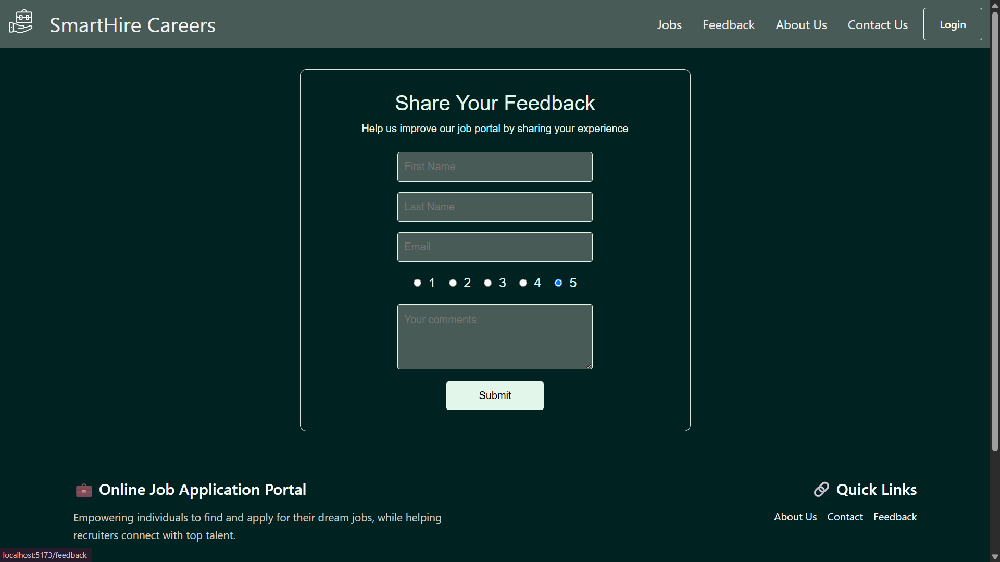

# 🧑‍💼 SmartHire Careers – Online Job Portal (Fullstack)

SmartHire Careers is a fullstack online job portal that connects job seekers and employers. It features user authentication, job management, feedback submission, and role-based access control. The project is built with **React.js** (Frontend), **Node.js/Express.js** (Backend), and **MySQL** (Database).

---

## 🚀 Features

### ✅ Authentication
- User **Sign Up**, **Sign In**, and **Logout** functionality.
- JWT-based session management.

### 💼 Job Management
- Post, edit, and delete job listings (Admin/Employer roles).
- View dynamic job listings from the backend.
- Apply for jobs via a popup form.

### 💬 Feedback & Contact
- Submit feedback with ratings and comments.
- Contact form for inquiries.

### 🧑‍💻 Role-Based Access
- Admin and Employer access for job management and user control.
- Public users can view jobs, contact, and provide feedback.

---

## 🧱 Technologies Used

### Frontend
- React, React Router DOM
- React Bootstrap, Bootstrap, CSS
- Axios, React Toastify

### Backend
- Node.js, Express.js
- MySQL (via mysql2)
- JWT, bcrypt
- Middleware: cookie-parser, cors

---

## 📁 Project Structure

### Frontend (`/frontend`)

```plaintext
/src
├── components/
├── pages/
├── services/
├── styles/
├── App.jsx
└── main.jsx
```

### Backend (`/backend`)

```plaintext
/backend
├── app.js
├── middleware/
├── routes/
└── src/config/
```

---

## 🔗 Frontend Routes

| Path           | Component     | Access         |
|----------------|---------------|----------------|
| `/`            | Home          | Public         |
| `/signin`      | Signin        | Public         |
| `/signup`      | Signup        | Public         |
| `/jobs`        | Jobs          | Public         |
| `/post-job`    | PostJob       | Authenticated  |
| `/edit-jobs`   | EditJob       | Authenticated  |
| `/feedback`    | Feedback      | Public         |
| `/contact`     | Contact       | Public         |
| `/about`       | About         | Public         |

---

## 📘 Backend API Endpoints

### Auth
| Method | Endpoint  | Description        |
|--------|-----------|--------------------|
| POST   | `/signup` | Register user      |
| POST   | `/signin` | Login user         |
| GET    | `/logout` | Logout user        |

### Users
| Method | Endpoint    | Description                   |
|--------|-------------|-------------------------------|
| GET    | `/allUsers` | Paginated list of users       |
| GET    | `/user/:id` | Retrieve user by ID (JWT)     |
| PUT    | `/user/:id` | Update user (Admin only)      |
| DELETE | `/user/:id` | Delete user (Admin only)      |

### Jobs
| Method | Endpoint          | Description                       |
|--------|-------------------|-----------------------------------|
| POST   | `/job-post`       | Post job (Admin/Employer only)    |
| GET    | `/job-get`        | Retrieve all jobs                 |
| PUT    | `/job-edit/:id`   | Edit job (Admin/Employer only)    |
| DELETE | `/job-delete/:id` | Delete job (Admin/Employer only)  |

### Feedback
| Method | Endpoint         | Description                     |
|--------|------------------|---------------------------------|
| POST   | `/feedback-post` | Submit feedback (Public)        |
| GET    | `/feedback-get`  | View feedback (Admin only)      |

---

## 🗄️ Database Tables

### `usertable`
| Column    | Type                              |
|-----------|-----------------------------------|
| id        | INT                               |
| firstname | VARCHAR(30)                       |
| lastname  | VARCHAR(30)                       |
| email     | VARCHAR(100), UNIQUE              |
| password  | VARCHAR(100) (hashed)             |
| role      | tinyint(1) (0=employer, 1=admin)  |

### `job_data`
| Column  | Type          |
|---------|---------------|
| id      | INT           |
| role    | VARCHAR(50)   |
| skills  | VARCHAR(500)  |
| details | VARCHAR(1000) |

### `feedback`
| Column    | Type         |
|-----------|--------------|
| firstname | VARCHAR(30)  |
| lastname  | VARCHAR(30)  |
| email     | VARCHAR(100) |
| rating    | TINYINT      |
| comments  | TEXT         |

---

## ⚙️ Setup Instructions

### Prerequisites
- Node.js, npm, and MySQL installed

### Backend Setup

```bash
cd backend
npm install
node app.js
```

> Ensure MySQL is running and the credentials match in `src/config/dbconfig.js`.

### Frontend Setup

```bash
cd frontend
npm install
npm run dev
```

> The frontend expects the backend at `http://localhost:7800`.

---

## 📸 Preview

Here’s how the page looks:

 
 
 
 
 
 
 
 

---
